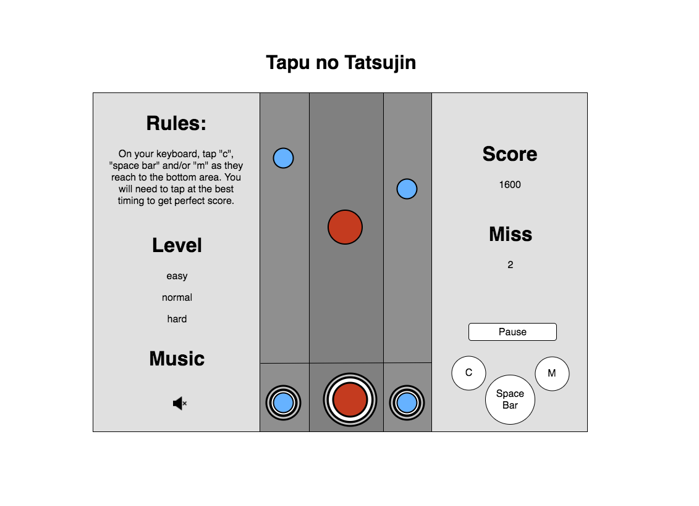

# The Master of Tap (Tapu no Tatsujin)

## Prologue

The Master of Tap is a web game inspired by the famous arcade game, "Taiko no Tatsujin". Taiko no Tatsujin, which literally means the Taiko Master, is a game where players simulate playing a Taiko drum in time with music.

This replication game will be structured with 2 empty (circle) on each corner of the screen. Then once the game starts, player will see beats (represent in circles) scrolling across the screen.  As these beats reaches to indicated area, the player must tap the key at the right timing in order to receive scores.  

## Functionality and MVP

Players will be able to perform the following actions:
  * start and pause the game.
  * choose a level of difficulty.
  * see their scores.
  * user the valid keyboards to receive points.
  * ability to mute music.

Games Interface will include:
  * music.
  * keyboards display and rules of play.

## Wireframes

The game will be consist of a single screen split into three sections.  
Section One will be displaying the rules of how to game the game.
Section Two will be the gaming area, where beats (represent in circles) will scroll from the top of the screen to the bottom. Once the beats reach to the bottom space, player must tap the keyboard in order to receive the points.

## Architecture and Technologies
  * Vanilla JavaScript for overall structure of the game.
  * Easel.js with HTML5 Canvas for DOM manipulation and rendering.
  * Webpack bundle to incorporate multiple files.

  There will be three major elements for this game:
  `view.js` : Handles the logic of creating and updating canvas element and render them onto DOM.
  `tap.js` : Functions of the beats.
  `game.js` : Handles the logic of the game.

## Implementation Timeline
  ** Day 1 ** Setup all necessary modules: `view.js`
        - Prepare all the assets (background, beats, and music)
        - Set Up `webpack`
          * Download and install `Easel.js`.
          * Get all three files bundled up with entry files.
  ** Day 2 ** : Complete the tap module where beats scroll across the scree. `tap.js`
        - Complete the beats module (constructor and functions)
        - render all the beats in the canvas
  ** Day 3 ** : Implement game logic of beats matching with player's timing. `game.js`
        - Game logic: if beats and taps matched, then player get scores, else, they miss the hit.
        - Styling.
  ** Day 4 ** : Continue on styling, include interactive Functionality for the player so that they can choose level of difficulties, start and pause game, turn on or off music.

## Bonus Features

  - More music choices.
  - Multi-player mode.
